# Reporte de Pruebas Exploratorias

**Proyecto:** Optimizador de Envíos  
**Fecha de ejecución:** 9 de abril de 2026  
**Ambiente:** Docker local en `http://localhost:3000`  
**Navegador:** Google Chrome  
**QA Responsable:** [Nahuel Lemes](https://github.com/nahulemesF)

**Usuarios utilizados durante la sesión**
- Usuario A: `qa.usuario@example.com` / `Password123`
- Usuario B: `qa.usuariob@example.com` / `Password123`

## Descripción general de la exploración

Durante esta exploración me enfoqué en los flujos que más impacto tienen sobre la experiencia completa: autenticación, registro, creación del envío, cálculo de recomendaciones y visualización del mapa. En términos generales, la aplicación se pudo recorrer completamente sin bloqueantes críticos.

Los hallazgos más relevantes quedaron concentrados en validaciones del lado cliente y en algunos detalles de UX, pero ninguno de estos puntos impidió completar los casos de uso.

## Alcance de la exploración

- Autenticación, logout y consulta de historial.
- Registro de nuevos usuarios y manejo de errores.
- Formulario principal, autocompletado de ciudades y selección de prioridad.
- Recomendación de proveedor, alternativas y confirmación del pedido.
- Comportamiento visual y responsive del mapa.

## 1. TC-HU08-08 - Autenticación, logout e historial

### Objetivo

Comprobar que el login, el cierre de sesión, la protección de rutas y el historial funcionen de forma consistente, y que los datos de un usuario no queden expuestos a otro.

### Recorrido ejecutado

- Login exitoso con Usuario A.
- Revisión del historial del Usuario A.
- Logout y validación de bloqueo de rutas protegidas.
- Prueba con botón "atrás" luego del logout.
- Acceso con Usuario B para verificar aislamiento de datos.

### Lo observado

**Login con Usuario A**

El formulario de acceso se presenta de forma clara, con los campos esperados y una jerarquía visual entendible. Al ingresar credenciales válidas, la navegación hacia el formulario principal es inmediata y el encabezado cambia correctamente al estado autenticado: aparece el nombre del usuario junto con las opciones de historial y cierre de sesión. 

> Nota: los mensajes de error por credenciales inválidas aparecen en inglés, lo cual es un detalle a mejorar para mantener la consistencia del idioma en la interfaz.

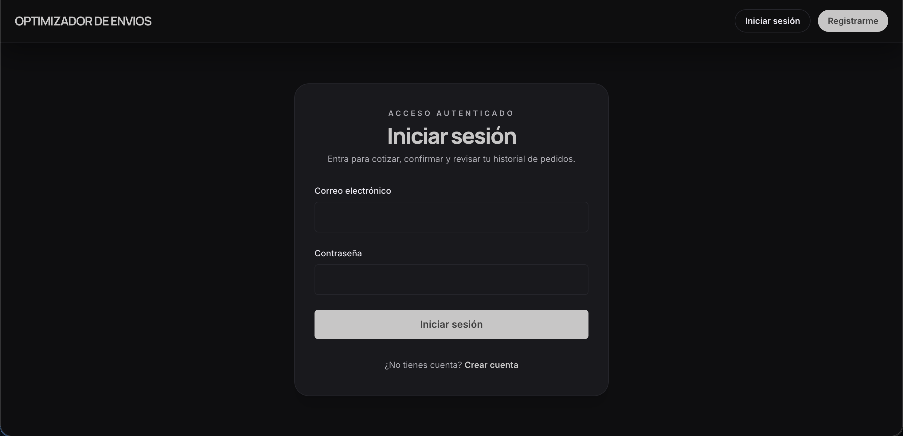

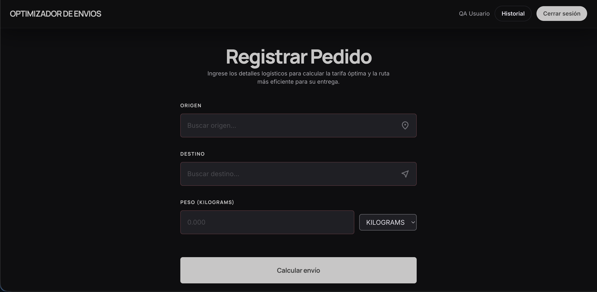

**Historial del Usuario A**

El historial cargó sin errores y mostró información suficiente para entender cada pedido: proveedor, origen, destino, peso, prioridad, distancia y fecha. 

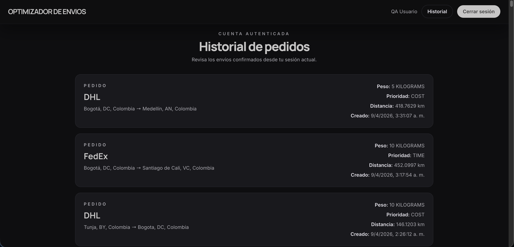

**Logout y protección de rutas**

El botón "Cerrar sesión" respondió bien y redirigió a login. Una vez fuera de la sesión, el encabezado volvió al estado público y no fue posible seguir navegando como usuario autenticado. También se probó volver con el botón del navegador y no aparecieron datos sensibles expuestos.

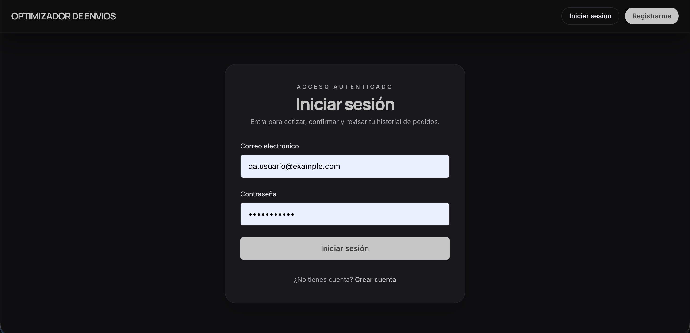

**Login con Usuario B**

El segundo usuario pudo iniciar sesión sin inconvenientes. El historial mostrado para esta cuenta estaba vacío o era distinto al del Usuario A, así que en esta sesión no hubo mezcla visible de información entre cuentas.

### Cierre del caso

| Campo | Resultado |
|---|---|
| Estado | Aprobado con observaciones |
| Resultado general | El flujo principal de autenticación funciona bien |
| Riesgo principal | Inconsistencias de idioma y posible contaminación de datos de prueba en historial |
| Evidencia | Capturas 01 a 05 |

### Hallazgos

| ID | Descripción | Tipo | Severidad |
|---|---|---|---|
| H-01 | Los mensajes de error del login aparecen en inglés, mientras el resto de la interfaz está en español | Hallazgo UX | Baja |

---

## 2. TC-HU07-06 - Formulario de registro

### Objetivo

Revisar el comportamiento del formulario de registro de usuario, con foco en validaciones, claridad de errores, manejo de duplicados y experiencia general del formulario.

### Recorrido ejecutado

- Apertura del registro desde login y desde el header.
- Envío del formulario vacío o incompleto.
- Pruebas con email inválido, contraseña corta y email ya existente.
- Corrección progresiva de errores.
- Validación del enlace de regreso a login.

### Lo observado

**Primer vistazo al formulario**

La pantalla mantiene la misma línea visual del login y la navegación hasta ese punto es sencilla. Los campos visibles son los esperables: nombre, correo electrónico y contraseña.

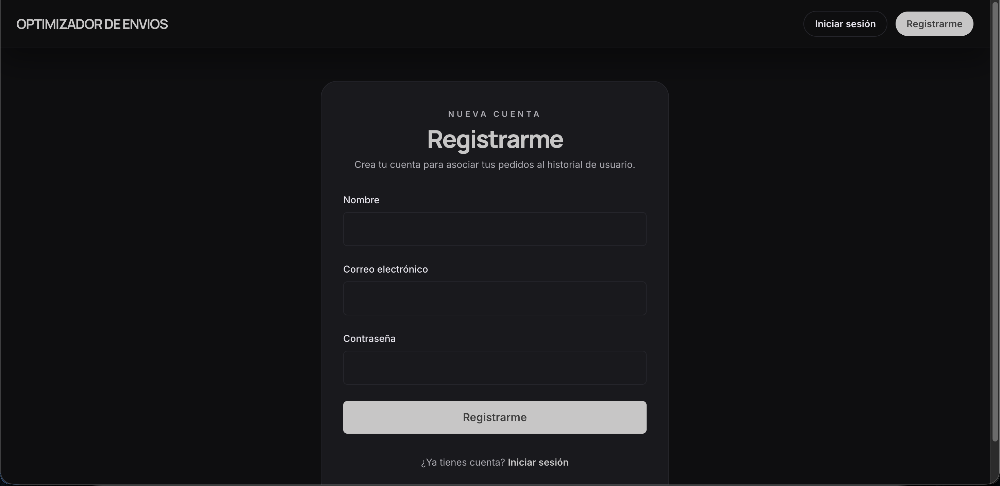

**Mensajes de validación**

En este formulario se encontraron varios detalles mejorables. Cuando falta el nombre o el email tiene un formato inválido, el backend responde con mensajes claros en cuanto al contenido, pero poco cuidados en cuanto a experiencia: están en inglés y se muestran con un tono demasiado técnico para un usuario final.

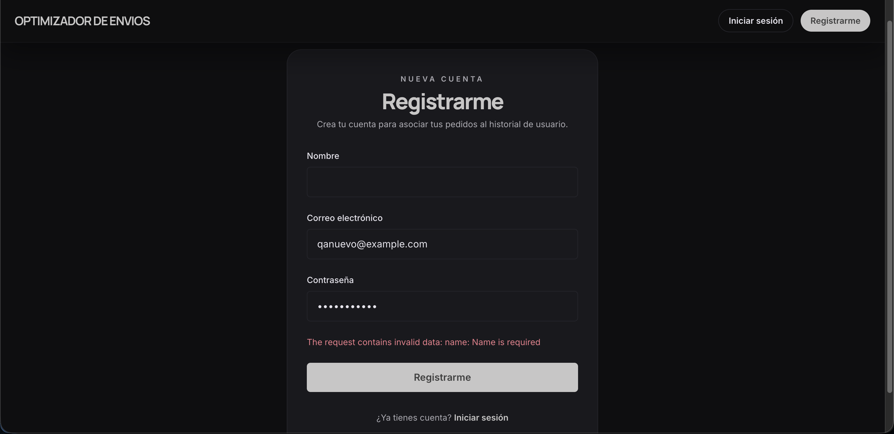

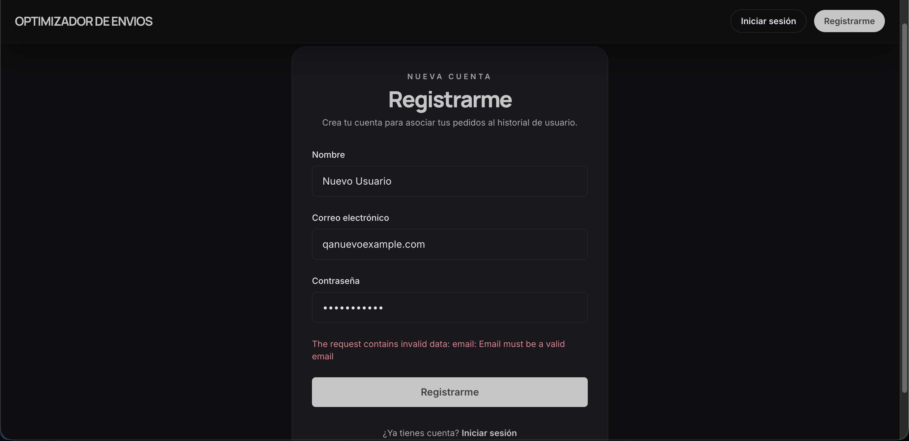

**Email duplicado**

Con `qa.usuario@example.com`, que ya existe en el sistema, el formulario devuelve un mensaje redundante: `"Email is already in use: Email is already in use"`. El error se entiende, pero da una sensación poco pulida.

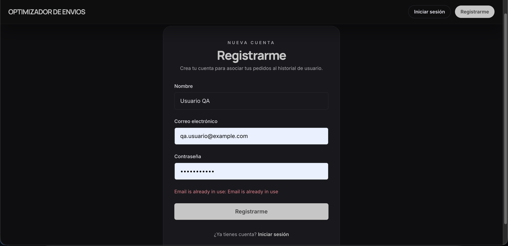

**Comportamiento general**

Los datos del formulario no se pierden después de un envío fallido, lo cual ayuda bastante a corregir sin frustración. Se recomienda implementar feedback de carga durante el proceso de registro, ya que al hacer clic en "Registrarme" no hay indicación visual de que la acción está en curso, lo que puede llevar a dudas o a intentos repetidos.

### Cierre del caso

| Campo | Resultado |
|---|---|
| Estado | Aprobado con observaciones |
| Resultado general | El registro funciona, pero la experiencia de validación todavía se siente inmadura |
| Riesgo principal | Doble submit y mensajes poco amigables |
| Evidencia | Capturas 06 a 09 |

### Hallazgos

| ID | Descripción | Tipo | Severidad |
|---|---|---|---|
| H-02 | Mensajes de error en inglés en una interfaz que, por lo demás, está en español | Hallazgo UX | Baja |
| H-03 | El mensaje de email duplicado repite el mismo texto dos veces | Bug UX | Baja |
| H-04 | El botón "Registrarme" no se deshabilita durante el envío, por lo que existe riesgo de doble submit | Riesgo técnico | Media |
| H-05 | No hay opción para mostrar u ocultar la contraseña | Observación UX | Baja |
| H-06 | Las validaciones ocurren únicamente del lado servidor; no hay ayuda temprana en cliente | Observación técnica | Baja |
| H-07 | Los errores no se limpian al editar el campo; permanecen visibles hasta el próximo submit | Hallazgo UX | Baja |

---

## 3. TC-HU01-09 - Formulario principal, autocompletado y prioridad

### Objetivo

Evaluar la estabilidad del formulario principal, la experiencia del autocompletado de ciudades, el ingreso del peso y la selección de prioridad antes del cálculo.

### Recorrido ejecutado

- Búsqueda de ciudades con escritura rápida y lenta.
- Prueba con nombres acentuados.
- Selección de origen y destino para generar vista previa del mapa.
- Ingreso de pesos válidos e inválidos.
- Revisión del selector de prioridad y del botón de cálculo.

### Lo observado

**Autocompletado de ciudades**

El autocompletado funcionó bien con consultas parciales como "Medell". Las sugerencias llegaron rápido, se mostró el estado de "Buscando..." mientras la API respondía y, en esta exploración, los resultados quedaron restringidos a ciudades de Colombia, que es lo esperado para este caso de uso.

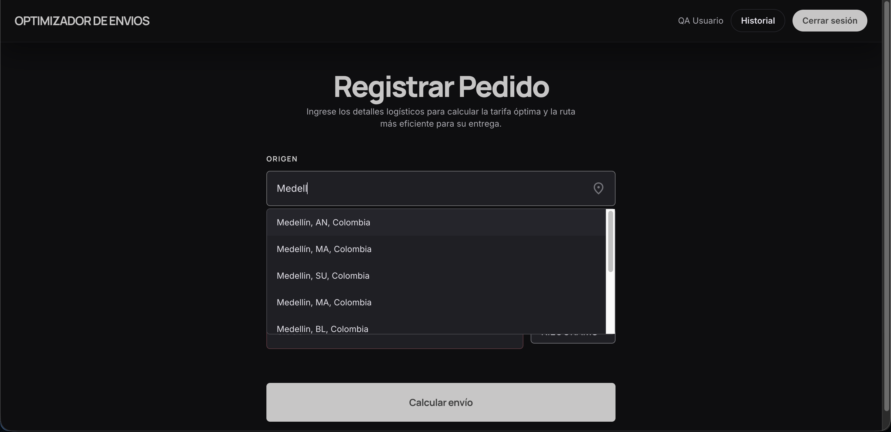

También se observó que al escribir rápido no se vio una cascada de requests innecesarios, lo que sugiere que hay algún tipo de debounce implementado.

**Vista previa del mapa**

Una vez elegidos origen y destino, el mapa apareció automáticamente con la ruta dibujada. Los marcadores se distinguen bien y ayudan a validar de forma visual si la selección fue correcta antes de seguir.

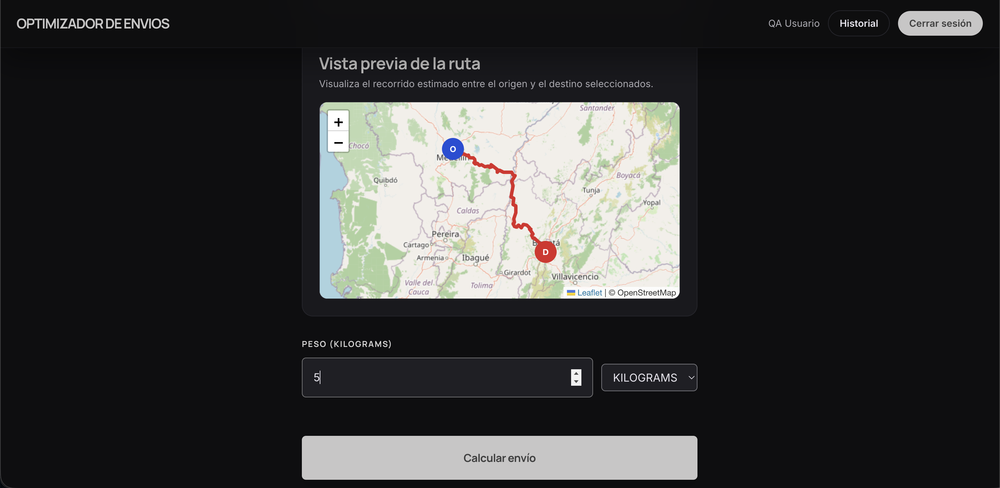

**Ingreso del peso**

El campo acepta decimales y muestra `0.000` como valor inicial. Funcionalmente se puede usar, pero la elección de ese valor por defecto puede generar dudas: no queda del todo claro si es un placeholder o un dato listo para enviar. Además, no encontré validación visual inmediata para pesos fuera de rango; los controles parecen depender del backend para marcar el error.

**Selección de prioridad**

La pantalla de prioridad está bien resuelta. Las dos opciones se entienden, tienen diferencia visual clara y obligan a una elección explícita. Esa parte del flujo se siente consistente y fácil de usar.

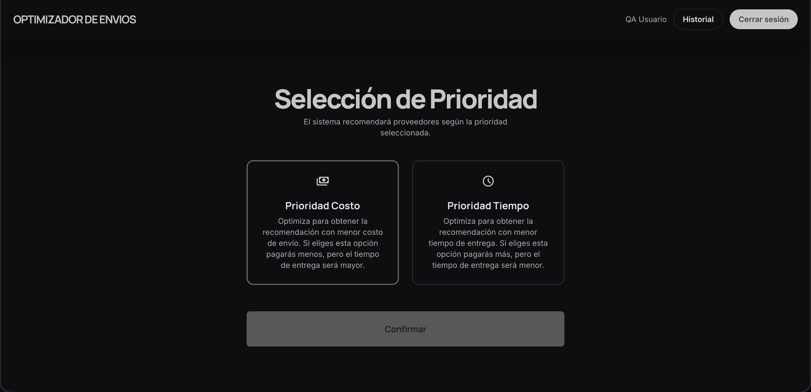

**Pantalla de resultados**

La recomendación principal y las alternativas se entienden rápido. La jerarquía entre la mejor opción y el resto está bien marcada, y el botón para confirmar queda ubicado donde uno esperaría.

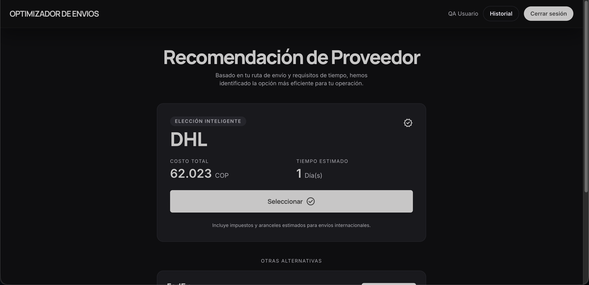

### Cierre del caso

| Campo | Resultado |
|---|---|
| Estado | Aprobado con observaciones |
| Resultado general | El flujo se puede completar, pero faltan controles preventivos en cliente |
| Riesgo principal | Sin validación client-side para peso, lo que puede llevar a errores evitables antes de llegar al backend |
| Evidencia | Capturas 10 a 13 |

### Hallazgos

| ID | Descripción | Tipo | Severidad |
|---|---|---|---|
| H-08 | No hay validación client-side visible para el rango de peso permitido (`0.001` a `70` kg) | Riesgo técnico | Media |
| H-09 | El valor inicial `0.000` en peso puede prestarse a confusión | Hallazgo UX | Baja |
| H-10 | El botón "Calcular envío" permanece habilitado aunque todavía falten datos obligatorios | Hallazgo UX | Media |
| H-11 | En las sugerencias del autocompletado aparecen resultados muy similares o visualmente duplicados | Observación menor | Baja |

---

## 4. TC-HU03-07 - Recomendación, alternativas y confirmación

### Objetivo

Verificar que la recomendación responda a la prioridad elegida, que las alternativas tengan sentido y que la confirmación del pedido cierre el flujo sin inconsistencias.

### Recorrido ejecutado

- Cálculo con prioridad costo.
- Comparación entre recomendación principal y alternativas.
- Selección manual de una alternativa distinta.
- Confirmación del pedido.
- Revisión del pedido confirmado en historial.

### Lo observado

**Recomendación principal**

Para la ruta Bogotá -> Cali con prioridad `COST`, la aplicación recomendó DHL. En esa misma pantalla aparecieron FedEx y Local como alternativas, sin duplicar al proveedor destacado.

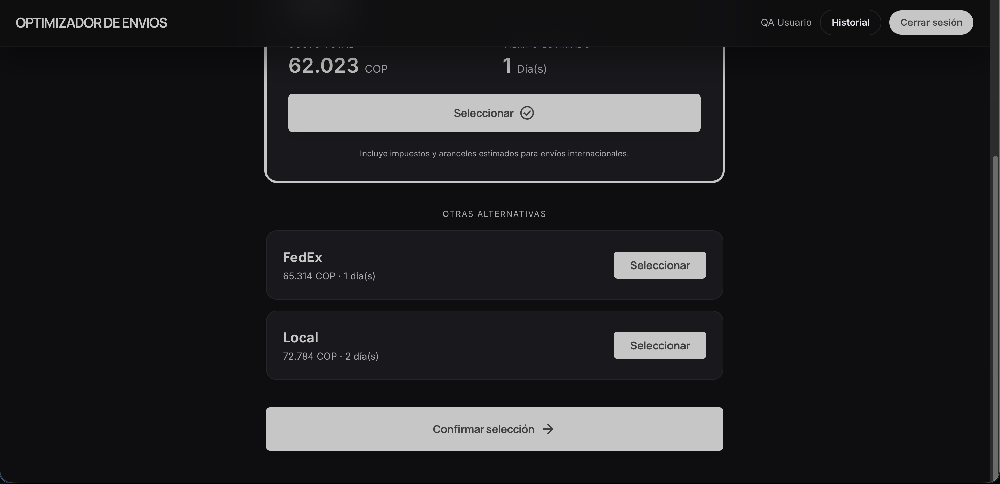

La decisión por costo fue coherente con los datos presentados. De todas formas, en este ejemplo puntual el proveedor recomendado también resultó ser el más rápido, así que no se llegó a tensionar realmente la lógica de desempate entre costo y tiempo.

**Selección y confirmación**

Se pudo cambiar manualmente la opción elegida y continuar con el proveedor alternativo sin que el flujo se rompiera. La pantalla de confirmación mostró un resumen claro del pedido y la ruta en mapa, lo que ayuda a validar una última vez antes de dar por cerrado el envío.

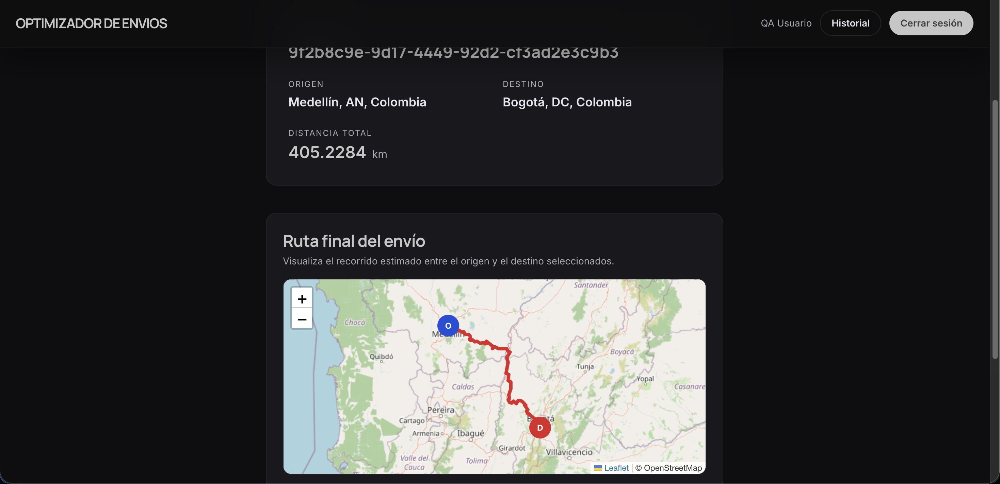

**Verificación posterior**

Después de confirmar, el pedido quedó visible en historial con datos consistentes. No vi duplicados entre recomendación principal y alternativas, lo cual es una buena señal para la presentación del resultado. Los textos de prioridad y proveedor se mostraron correctamente.

### Cierre del caso

| Campo | Resultado |
|---|---|
| Estado | Aprobado con observaciones |
| Resultado general | El flujo central de recomendación y confirmación funciona |
| Riesgo principal | Algunos textos y comportamientos de navegación todavía se sienten poco refinados |
| Evidencia | Capturas 15 y 16 |

### Hallazgos

| ID | Descripción | Tipo | Severidad |
|---|---|---|---|
| H-13 | Se muestra el texto "Incluye impuestos y aranceles estimados para envíos internacionales" incluso en envíos nacionales | Hallazgo UX | Baja |
| H-14 | No se observó feedback visual de carga durante la confirmación | Observación UX | Baja |
| H-15 | En algunas vistas los importes aparecen sin un formato consistente de miles | Observación UX | Baja |
| H-16 | Al volver atrás, el formulario no preserva la información ingresada previamente | Hallazgo UX | Media |

---

## 5. TC-HU06-06 - Exploratoria visual del mapa

### Objetivo

Comprobar que el mapa renderice bien en escritorio y en resoluciones más chicas, que la ruta se vea completa y que el comportamiento visual se mantenga estable al interactuar con zoom y recarga.

### Recorrido ejecutado

- Revisión del mapa en desktop.
- Zoom in y zoom out.
- Prueba visual en tablet y mobile.
- Recarga de página.
- Ruta larga Bogotá -> Cartagena para validar autoajuste.

### Lo observado

**Render inicial**

Los tiles de OpenStreetMap cargaron correctamente y la ruta quedó visible sin zonas en blanco. Los marcadores de origen y destino se distinguen bien y el autoajuste de cámara hace su trabajo sin obligar al usuario a recentrar manualmente.

**Interacción**

Los controles de zoom respondieron bien y no aparecieron glitches al acercar o alejar la vista.

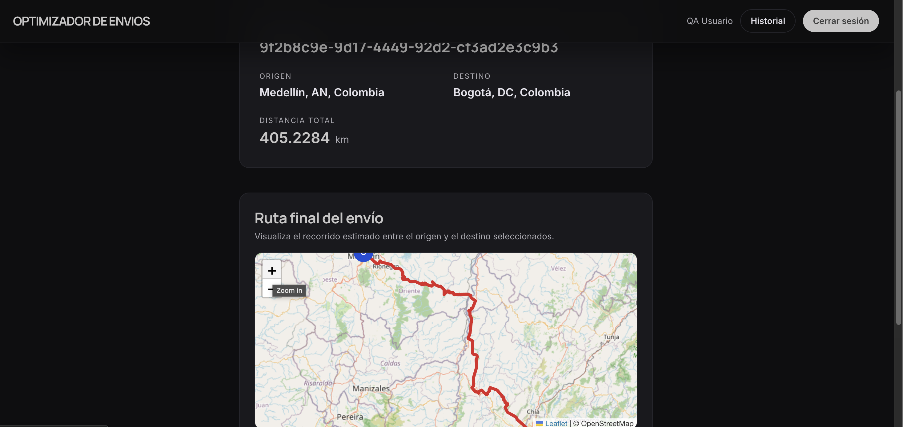

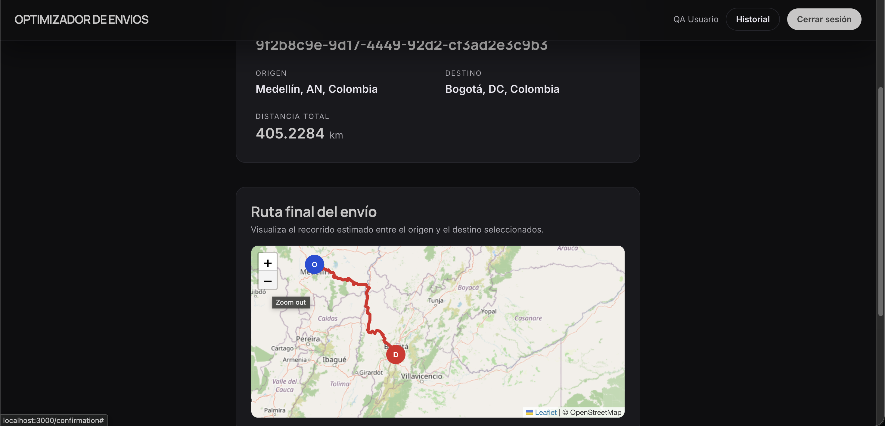

**Responsive**

En tablet el componente sigue siendo cómodo de usar. En mobile, en cambio, el mapa continúa siendo legible pero los controles de zoom quedan algo chicos para interacción táctil. No rompe el flujo, aunque sí lo vuelve menos amable.

**Ruta larga**

Con el tramo Bogotá -> Cartagena el mapa ajustó bien el encuadre y permitió ver la ruta completa.

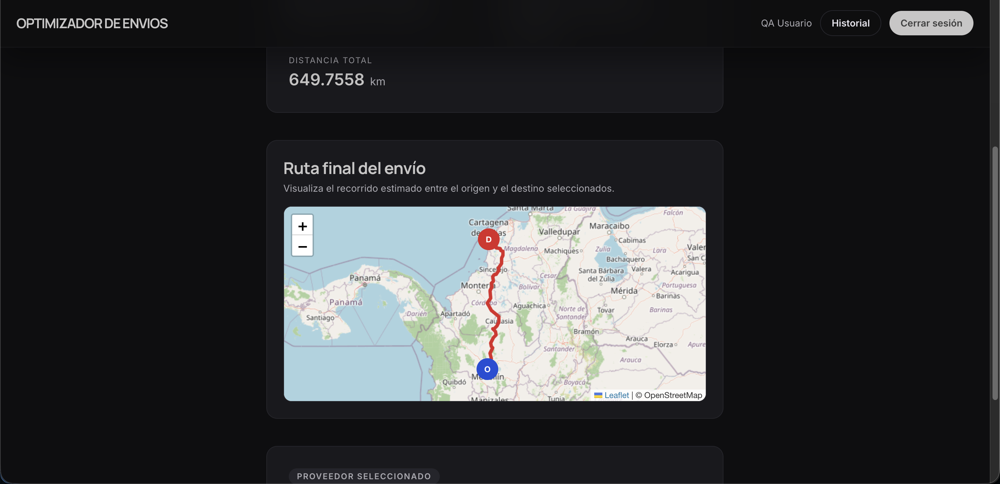

### Cierre del caso

| Campo | Resultado |
|---|---|
| Estado | Aprobado |
| Resultado general | El mapa es estable y acompaña bien el flujo principal |
| Riesgo principal | Ajustes menores de usabilidad en pantallas pequeñas |
| Evidencia | Capturas 17 a 19 |

### Hallazgos

| ID | Descripción | Tipo | Severidad |
|---|---|---|---|
| H-17 | En mobile, los controles de zoom se sienten pequeños para interacción táctil | Observación UX | Baja |
| H-18 | La atribución de Leaflet/OpenStreetMap compite visualmente con el mapa en resoluciones reducidas | Observación UX | Info |

---

## Resumen consolidado de hallazgos

### Distribución por severidad

| Severidad | Cantidad | Hallazgos |
|---|---|---|
| Crítica | 0 | No se detectaron |
| Alta | 0 | No se detectaron |
| Media | 4 | H-05, H-09, H-11, H-16 |
| Baja | 12 | H-01, H-03, H-04, H-06, H-07, H-08, H-10, H-12, H-13, H-14, H-15, H-17 |
| Info | 2 | H-02, H-18 |

### Hallazgos que convendría atender primero

| Prioridad | ID | Descripción | Motivo |
|---|---|---|---|
| 1 | H-05 | Posible doble submit en registro | Puede generar solicitudes duplicadas o estados inconsistentes |
| 2 | H-09 | Sin validación client-side para peso | El error llega tarde y degrada la experiencia del flujo principal |
| 3 | H-11 | Botón "Calcular envío" habilitado sin datos completos | Invita a errores evitables antes de tiempo |
| 4 | H-16 | El formulario pierde datos al volver atrás | Afecta continuidad y obliga a reingresar información |
| 5 | H-01 / H-03 | Mensajes en inglés en flujos visibles para usuario final | Impacta percepción de calidad aunque no rompa funcionalidad |

### Resumen por caso de uso de la exploración

| Caso | Estado | Hallazgos principales | Bloqueantes | Evidencias |
|---|---|---|---|---|
| TC-HU08-08 | Aprobado con observaciones | Idioma en errores y datos repetidos en historial | Ninguno | Capturas 01 a 05 |
| TC-HU07-06 | Aprobado con observaciones | Validaciones poco amigables y riesgo de doble submit | Ninguno | Capturas 06 a 09 |
| TC-HU01-09 | Aprobado con observaciones | Falta de controles preventivos en peso y cálculo | Ninguno | Capturas 10 a 13 |
| TC-HU03-07 | Aprobado con observaciones | Ajustes pendientes en navegación y textos | Ninguno | Capturas 15 y 16 |
| TC-HU06-06 | Aprobado | Mejoras menores de usabilidad mobile | Ninguno | Capturas 17 a 19 |
